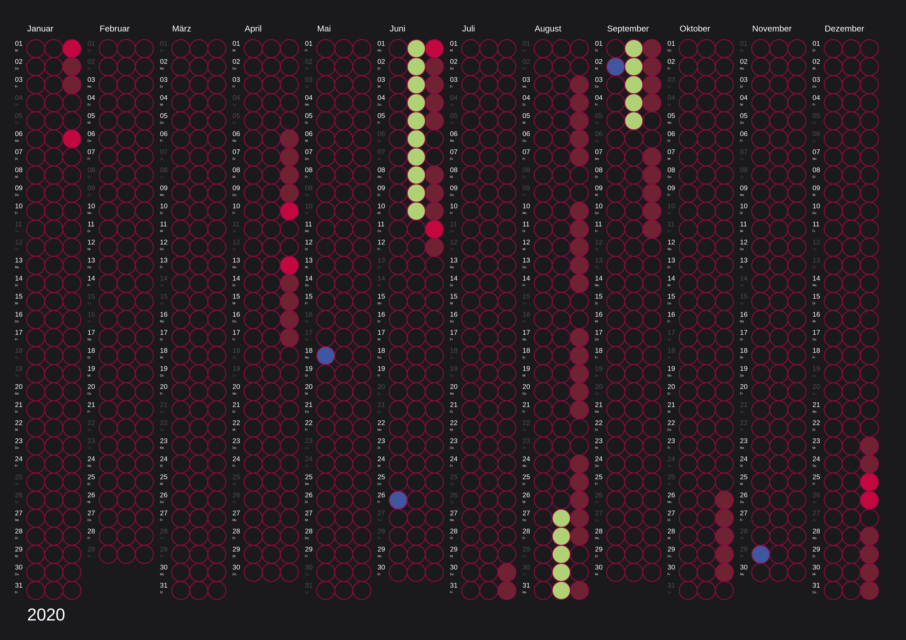
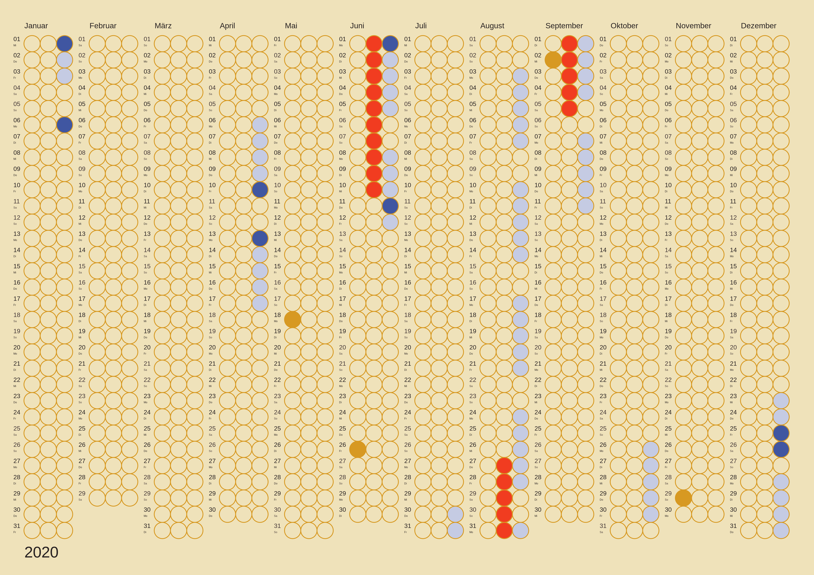
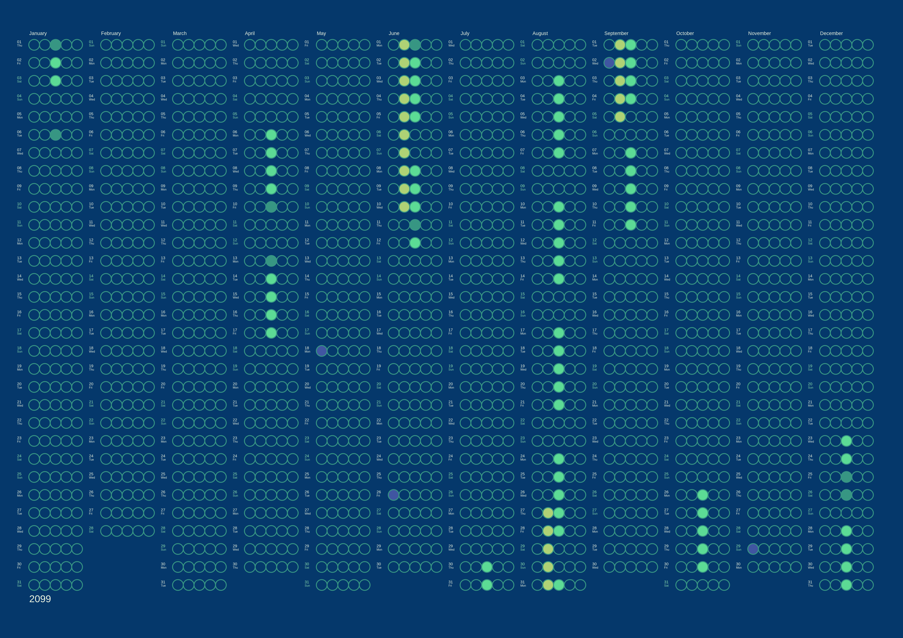

# `dot-calendar`


`dot-calendar` is a tool that allows anyone who loves dot calendars to create their own versions of the calendar.



The project was born because I like to have a physical calendar in addition to my digital calendar, where I can see at a glance what is scheduled and when. By chance I came across the [dot calendar style](https://www.dot-on.de/en) and decided that I would like to have my own version of the it. To avoid having to create a new vector graphic every year, I solved it programmatically.



## Prerequisites

Before you begin, ensure you have met the following requirements:

- You have installed node.

That's it ;) Admittedly, I didn't test the project on Windows, but it runs fine on Ubuntu and Mac.

## Using `dot-calendar`

Install all dependencies with

```bash
npm install
```

For a quick start, there are sample configurations in the `config` directory, such as [contemporary-and-bold.json](./config/contemporary-and-bold.json).

To create calendars from the sample configurations simply run the following command:

```bash
npm run start
```

## Customizations

It is easy to create your own versions of the calendar. All you have to do is make some configurations.

The basis is a `config.json`, in which color information, number of columns, year, distances etc. are configured. The interface is [here](./src/dot-calendar/DotCalendarProperties.type.ts).

Example:

```json
{
  "title": "contemporary-and-bold",
  "year": 2020,
  "language": "DE",
  "weekendColor": "#4E4E50",
  "general": {
    "width": 4961,
    "height": 3508,
    "textDistance": 100,
    "widthBuffer": 100,
    "bgColor": "#1A1A1D",
    "textFont": "Helvetica",
    "textColor": "#FFFFFF"
  },
  "dots": {
    "distanceBetweenCirclesX": 5,
    "distanceBetweenCirclesY": 5,
    "columns": 3,
    "dotStrikeColor": "#950740",
    "dotLineWidth": 10
  }
}
```

In addition to the basic information, dots can be marked with colors. This is useful for school holidays, bank holidays, birthdays, etc. that are already known in advance. For this purpose `*.flag.json` files are configured. The payload is very simple - just use the examples if necessary.

Here is an example with 5 instead of 3 columns per month and adjusted distances for the year _2099_. This can be done by simply changing the `columns` and `distanceBetweenCirclesY` values.



## Contributing to `dot-calendar`

To contribute to `dot-calendar`, follow these steps:

1. Fork this repository.
2. Create a branch: `git checkout -b <branch_name>`.
3. Make your changes and commit them: `git commit -m '<commit_message>'`
4. Push to the original branch: `git push origin urbanisierung/dot-calendar`
5. Create the pull request.

Alternatively see the GitHub documentation on [creating a pull request](https://help.github.com/en/github/collaborating-with-issues-and-pull-requests/creating-a-pull-request).

## Contact

If you want to contact me you can reach me at [adam.urban@gmail.com](mailto:adamurban@gmail.com).

## License

This project uses the following license: [MIT](./MIT.md).

